# wechat-openai-qa-bot

[B站快速入门视频](https://www.bilibili.com/video/BV1Y54y1f7v1?share_source=copy_web)

## 简介

本项目使用wechat机器人快速实现一个免费的QA问答系统，如果你是一个社群工作者、拼团团长、业务群运营经理，使用这个项目可以帮助你解决一些重复性问答。

**前提是你有一台Windows电脑可以运行本项目。**

### 已经支持的功能：

- 群问答，可以自定义问答内容，智能匹配答案，支持相似问题匹配，例如“什么时候到货？”“亲，几时到货”“亲，什么时候到货”均能匹配

- 多个群相同问题不同回答内容，例如“何时到货？”,A群中回答“今天到”，B群中回答“明天到货”

- 免打扰功能，使用“QA+群ID+回答内容”匹配群，未配置问题答案的群不会受到机器人干扰

- 支持非群主小程序卡片、网页链接分享检测，自动提醒、警告发送者撤回

- 支持快团团订货单转换，原始表发送到群即可自动转换为按楼栋统计表（即将上线）

### 项目用到了一些工具和免费的轮子：

> 如果你是团长可忽略此段内容，开发者可进一步了解

- [Wechaty](https://wechaty.js.org/) —— In just a few lines of code, you can have a fully featured
Chatbot  !  !  !

- [wechaty-puppet-xp](https://github.com/atorber/puppet-xp) —— 可能是目前最好用的免费wechat机器人

- [微信对话开放平台](https://openai.weixin.qq.com/) —— 5分钟零基础免费一键搭建智能对话机器人，并应用于微信公众号、小程序、企业网站、APP等

## 快速入门

1. clone （下载）项目代码,运行以下命令：

```
git clone https://github.com/atorber/wechaty-wx-openai-link.git
```

考虑对git不熟悉的用户，可以在页面直接下载项目.zip到电脑上,下载后解压缩即可

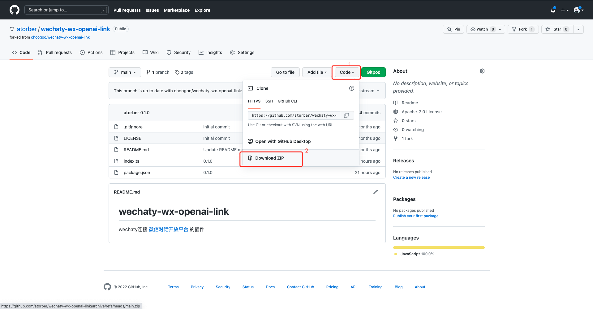

clone或下载解压缩之后的目录是这样

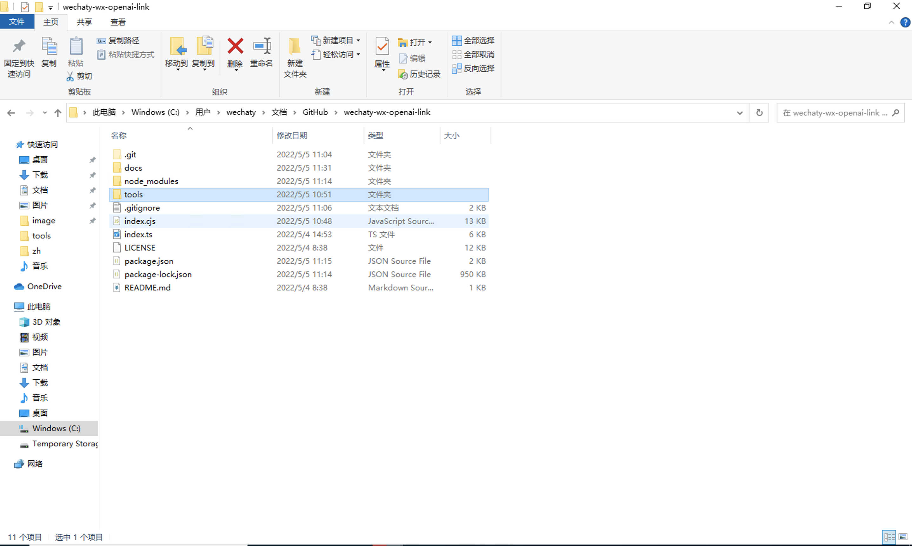

2. 安装nodejs，项目的tools目录下有相应的安装包node-v16.15.0-x64.zip，解压缩并安装；下载WeChatSetup-v3.3.0.115并安装（点击下载[WeChatSetup-v3.3.0.115.exe](https://github.com/wechaty/wechaty-puppet-xp/releases/download/v0.5/WeChatSetup-v3.3.0.115.exe)）

> 特别注意目前支持的微信客户端版本为 WeChatSetup-v3.3.0.115,如果电脑上已经安装了其他版本的微信，需要卸载之后安装项目中的版本

3. 安装依赖，假设当前系统为win10，在系统搜索栏中输入 powershell ，选择第一个结果


打开Windows PoweShell

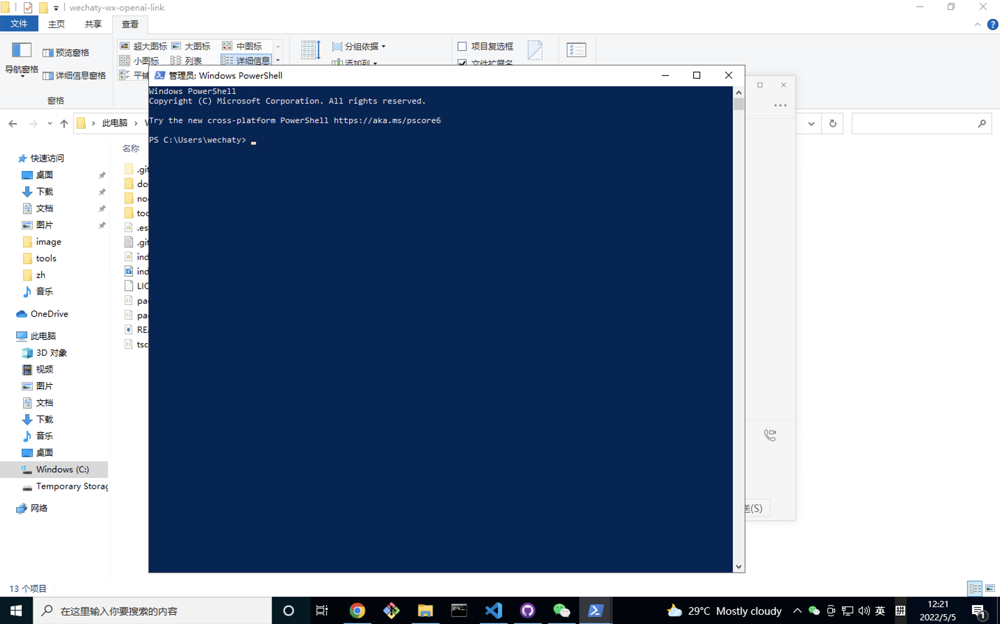

到项目目录下用鼠标点击地址栏复制文件路径，例如我当前的路径为 C:\Users\wechaty\Documents\GitHub\wechaty-wx-openai-link

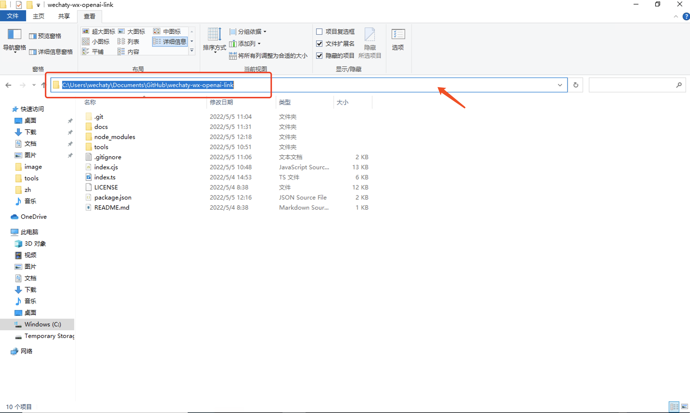

在复制如下命令在Windows PoweShell中执行

```
cd C:\Users\wechaty\Documents\GitHub\wechaty-wx-openai-link
npm install
```

3. 微信对话开放平台注册，访问[https://openai.weixin.qq.com/](https://openai.weixin.qq.com/)，导入示例数据及获取token

> 示例问答中的 xxx@chatroom 为你需要引入QA的群，此处特别注意，必须在回答中以 **QA+xxx@chatroom+回答内容** 才能达到在不同的群内有不同回答的效果

扫码登陆

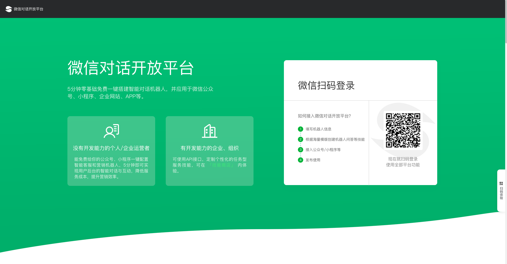

填写机器人信息


批量导入问答

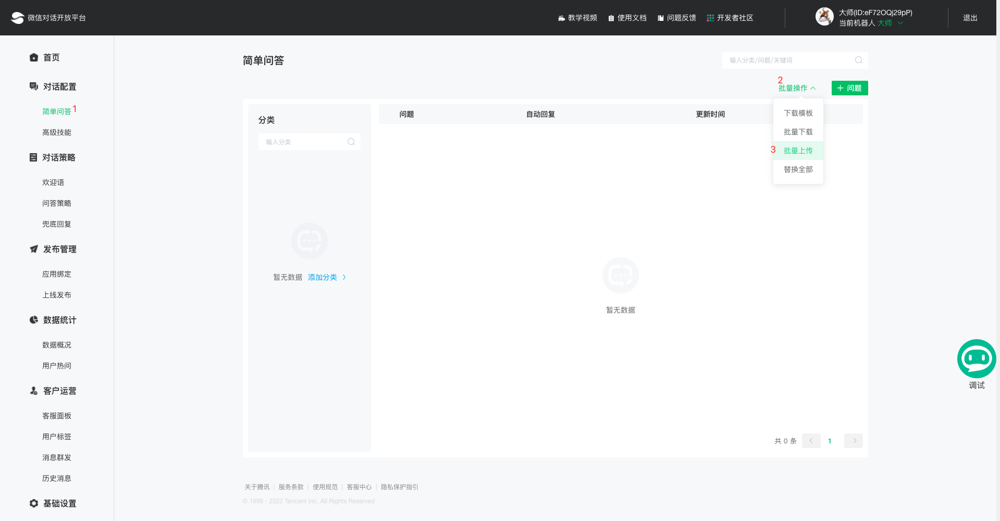

选择项目中tools目录下的示例问答

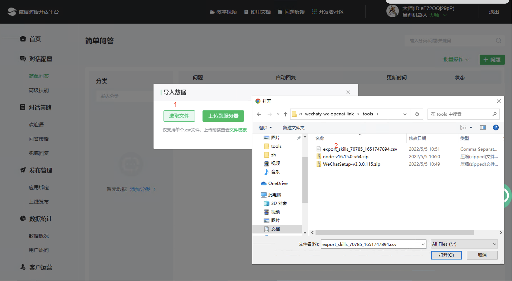

上传问答

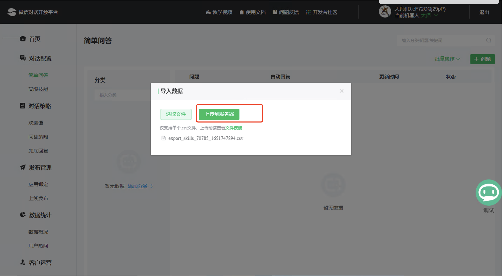

导入成功后问答列表

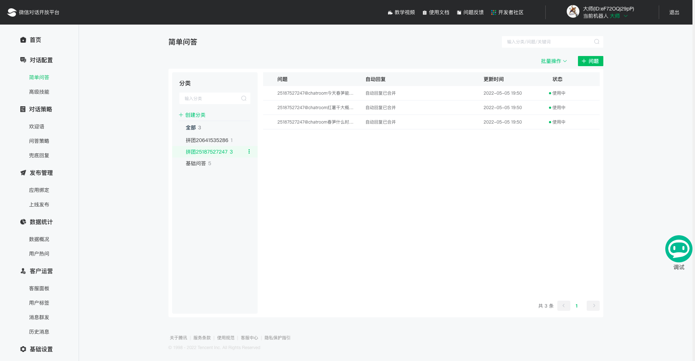

上线发布

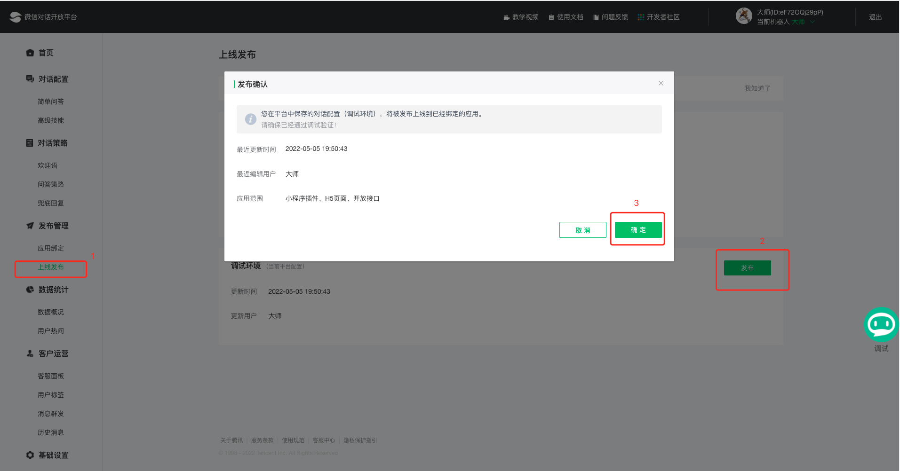

发布成功

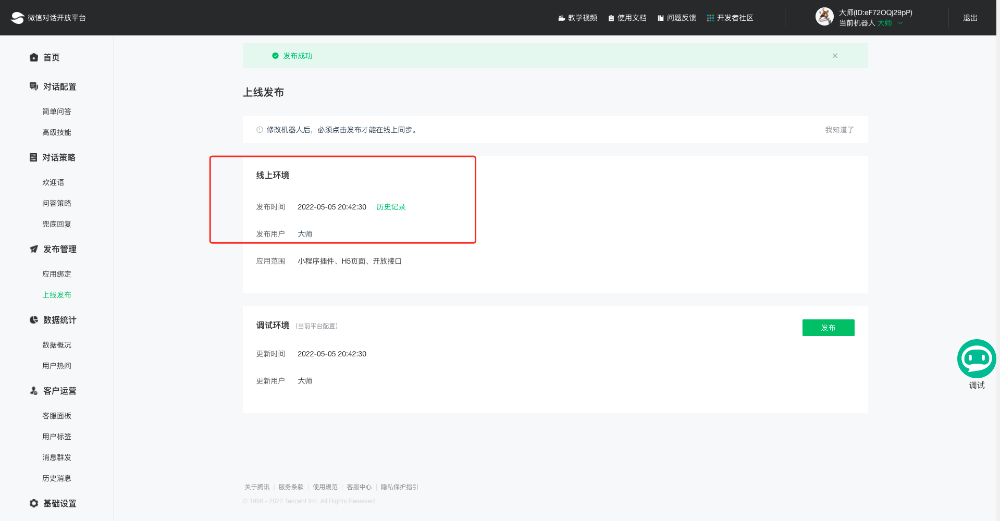

应用绑定，获取token

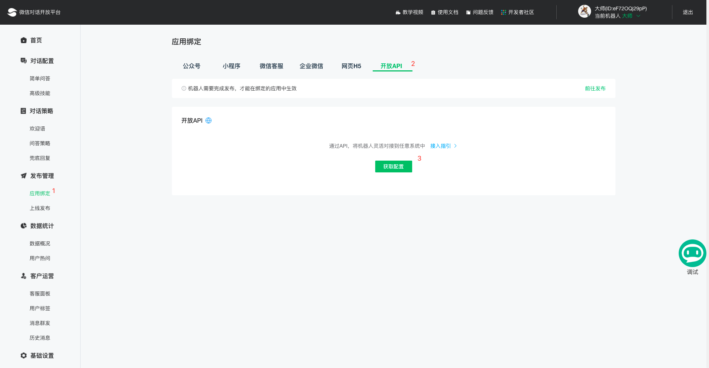

填写申请信息，提交后马上就会审核通过

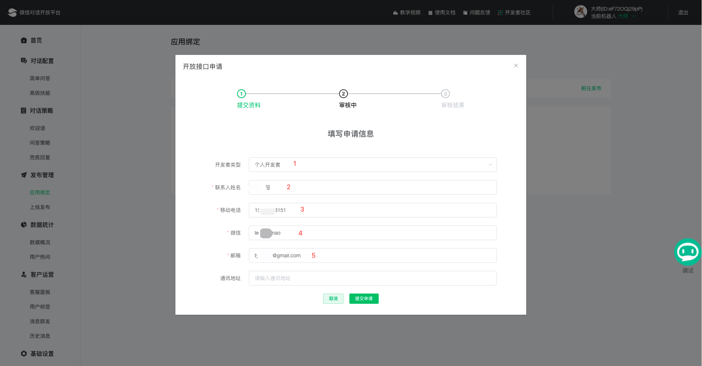

开通成功，复制token备用

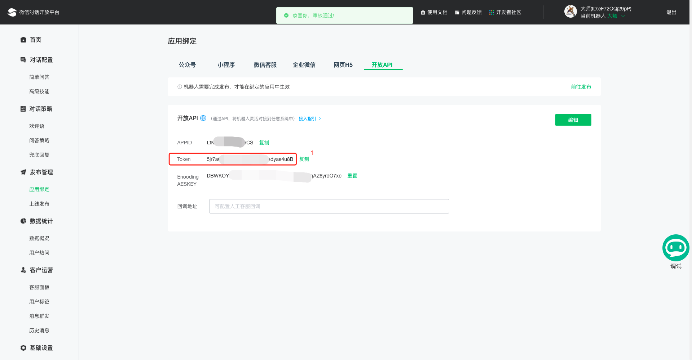

4. 启动系统，在获取token之后，准备启动系统

> 替换自己的微信对话开放平台token，如果set环境变量失败，可以尝试在index.ts中直接设置WX_TOKEN

```
set WX_TOKEN=5jr7a*************************4u8B
npm run start
```

顺利的话，恭喜你已经拥有一个QA机器人，接下来你需要在简单问答中继续导入你需要的问答内容

不顺利的话...请截图留言...

## 效果

- 程序运行成功

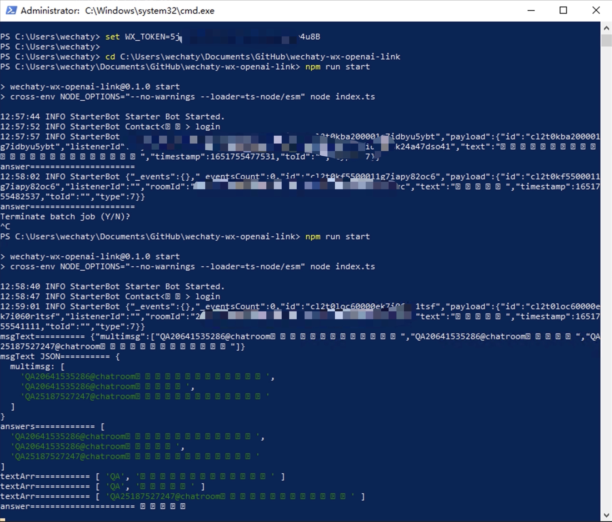

- 问答


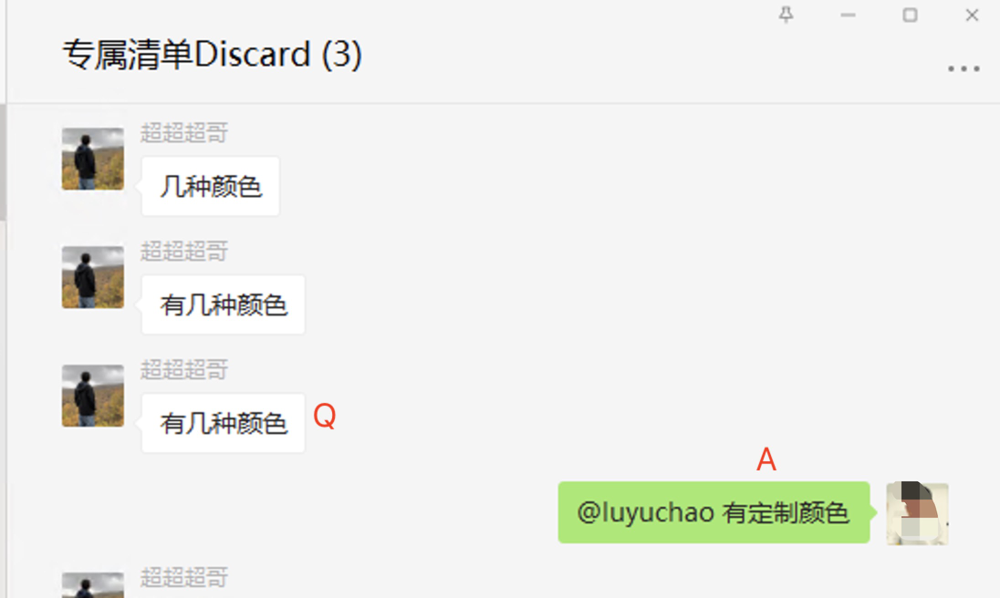

## 快速体验

如果你对以上操作感觉困难而不能使用，添加ledongmao微信，提供你需要的问答清单，我们可以提供一个免费的机器人供体验

当然，最好的反馈方式是在这里 https://github.com/choogoo/wechat-openai-qa-bot/issues 提交一个issues

## 二次开发

此项目只是提供了一个简单的使用微信机器人和智能对话平台实现的QA系统。如果有兴趣，可以继续学习微信对话开放平台的高级技能，实现诸如连续问答等高级功能，欢迎贡献你的创意。

此外要说明的是，项目中使用puppet-xp完全是出于免费的考虑，如果不考虑这一点的话，wechaty还有更好用的puppet，对于有能力的开发者来说可以根据实际情况替换。

## 常见问题

**遇到任何报错，一定记得第一时间查看报错信息，即使看不懂，起码复制或截图，否则没有人能仅凭几句语焉不详帮你解决问题**

1. 安装依赖时提示需要Visual Studio 2017+

去微软官网下载[Visual Studio 2022](https://visualstudio.microsoft.com/zh-hans/thank-you-downloading-visual-studio/?sku=Community&channel=Release&version=VS2022&source=VSLandingPage&cid=2030&passive=false)并安装


2. 关于远程协助，如果折腾半天也没有搞定，可以申请远程协助帮助安装

提前下载好[向日葵](https://sunlogin.oray.com/download)软件并注册号账号，登陆后发控制码


3. 下载解压缩软件

[2345好压](https://haozip.2345.cc/)

