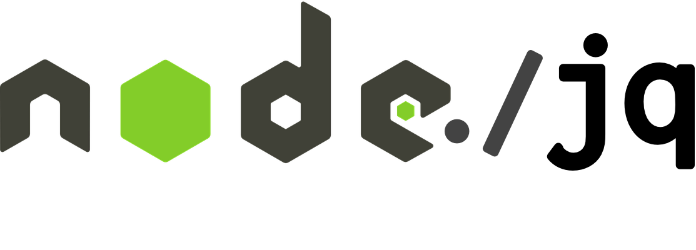

<p align="center">
  
  <br>
  <a href="http://standardjs.com/"></a>
  <a href="https://lima.codeclimate.com/github/sanack/node-jq/coverage"></a>
  <a href="https://lima.codeclimate.com/github/sanack/node-jq"></a>
  <br>
  <a href="https://www.npmjs.com/package/node-jq"></a>
  <a href="https://www.npmjs.com/package/node-jq"></a>
  <br>
    <a href="https://travis-ci.org/sanack/node-jq">
      
    </a>
    <a href="https://ci.appveyor.com/project/sanack/node-jq">
      
    </a>
</p>

<p align="center">
  <a href="https://github.com/sanack/node-jq">node-jq</a> is a Node.js wrapper for <a href="https://stedolan.github.io/jq/">jq</a> - a lightweight and flexible command-line JSON processor
</p>

---

## Installation

```bash
$ npm install node-jq --save
# or
$ yarn add node-jq
```

## Advanced installation

By default, `node-jq` downloads jq on the installation process (when you run `npm install node-jq`). Downloads the binaries according to your SO.

After that to run jq directly. Like: `./node_modules/node-jq/bin/jq . package.json`.

If you want to skip the installation of `jq`, set `NODE_JQ_SKIP_INSTALL_BINARY` to 'true' like:

```bash
$ export NODE_JQ_SKIP_INSTALL_BINARY=true
$ npm install node-jq
```

## Usage

#### jq example

Usually in your CLI using `jq`:
```bash
$ jq ".abilities[].moves" bulbasaur.json
```
and you get
```bash
{
  "name": "heartgold-soulsilver",
  "power": "10"
}
{
  "name": "platinum",
  "power": "50"
}
{
  "name": "diamond-pearl",
  "power": "99"
}
```

#### node-jq equivalent

With `node-jq` you could run it programmatically and interact with the output as a [JavaScript Object](http://javascript.info/tutorial/objects):

> NOTE: Take care of the filter that you are using with `jq`, mapping an array or any other iterative output isn't a valid JavaScript Object, that might fail at parse-time.

```javascript
const jq = require('node-jq')

const filter = '.abilities[].moves'
const jsonPath = '/path/to/bulbasaur.json'
const options = {}

jq.run(filter, jsonPath, options)
  .then((output) => {
    console.log(output)
    /*
      {
        "name": "heartgold-soulsilver",
        "power": "10"
      },
      {
        "name": "platinum",
        "power": "50"
      },
      {
        "name": "diamond-pearl",
        "power": "99"
      }
    */
  })
  .catch((err) => {
    console.error(err)
    // Something went wrong...
  })
```

## Options

### path to jq binary

By default, the jq binary installed with the package is used.
If you have special needs or want to use another binary in a different
path you can set the environment variable JQ_PATH to override the default
behaviour.

### input
|  Description  |  Type  |             Values             |  Default |
|:-------------:|:------:|:------------------------------:|:--------:|
| Type of input | string | `'file'`, `'json'`, `'string'` | `'file'` |
#### `input: 'file'`

Run the jq query against a **JSON file**.
```javascript
jq.run('.', '/path/to/file.json').then(console.log)
// { "foo": "bar" }
```

#### `input: 'file'`

Run jq query against multiple **JSON files**.
```javascript
jq.run('.', ['/path/to/file.json','path/to/other_file.json']).then(console.log)
// { "foo": "bar" }
// { "otherFoo": "andBar" }
```

#### `input: 'json'`

Run the `jq` query against an **Object**.
```javascript
jq.run('.', { foo: 'bar' }, { input: 'json' }).then(console.log)
// { "foo": "bar" }
```
#### `input: 'string'`

Run the jq query against a **String**.
```javascript
jq.run('.', '{ foo: "bar" }', { input: 'string' }).then(console.log)
// { "foo": "bar" }
```

---

### output
| Description    | Values                                        | Default    |
|:--------------:|:---------------------------------------------:|:----------:|
| Type of output | `'pretty'`, `'json'`, `'compact'`, `'string'` | `'pretty'` |

#### `output: 'pretty'`

Return the output as a **String**.
```javascript
jq.run('.', '/path/to/file.json', { output: 'string' }).then(console.log)
// {
//   "foo": "bar"
// }
```

#### `output: 'json'`

Return the output as an **Object**.
```javascript
jq.run('.', '/path/to/file.json', { output: 'json' }).then(console.log)
// { foo: 'bar' }
```

#### `output: 'compact'|'string'`

Return the output as a **String**.
```javascript
jq.run('.', '/path/to/file.json', { output: 'compact' }).then(console.log)
// {"foo":"bar"}
jq.run('.', '/path/to/file.json', { output: 'string' }).then(console.log)
// {"foo":"bar"}
```

---

### slurp
|         Description          |     Values      | Default |
|:----------------------------:|:---------------:|:-------:|
| Read input stream into array | `true`, `false` | `false` |

#### `slurp: true`

Read input stream into array.

```javascript
jq.run('.', ['/path/to/file.json','/path/to/other_file.json'], { output: 'json', slurp: true }).then(console.log)
// [
//   {
//     "foo": "bar"
//   },
//   {
//     "otherFoo": "andBar"
//   }
// ]
```

### sort
|         Description                   |     Values      | Default |
|:-------------------------------------:|:---------------:|:-------:|
| Sort object keys in alphabetical order| `true`, `false` | `false` |

#### `sort: true`

Sorts object keys alphabetically.
```javascript
jq.run('.', ['/path/to/file.json'], { output: 'json', sort: true }).then(console.log)
// {
//   "a": 2,
//   "b": 1
// },
```

## Projects using **node-jq**

- **[atom-jq](https://github.com/sanack/atom-jq)**: an [Atom](https://atom.io/) package for manipulating JSON
- **[json-splora](https://github.com/wellsjo/JSON-Splora)**: an [Electron](http://electron.atom.io/) implementation for manipulating JSON

## Why?

Why would you want to manipulate JavaScript Objects with `jq` inside a nodejs app, when there are tools like [ramda](https://ramdajs.com) or [lodash](lodash.com)?

The idea was to port `jq` in node to be able to run it as-is. `node-jq` doesn't try to replace `Array`/`Object` filters, maps, transformations, and so on.

Our primary goal was to make `jq` syntax available inside an [Atom](https://atom.io/) extension: [atom-jq](https://github.com/sanack/atom-jq).

Other than that, `jq` is an interesting CLI tool to quickly parse and manipulate the response of an API, such as:

```bash
curl 'https://jsonplaceholder.typicode.com/comments' | jq '.[].postId'
```

There are also people dealing with complex use-cases, and some of them want to port their bash scripts to node:

- [ilya-sher.org/2016/05/11/most-jq-you-will-ever-need](https://ilya-sher.org/2016/05/11/most-jq-you-will-ever-need/)
- [cloudadvantage.com.au/new-aws-command-line-tool-and-jq](http://www.cloudadvantage.com.au/new-aws-command-line-tool-and-jq/)

## Want to learn `jq`?

Seems hard to learn, but it really isn't.

`jq` is like `sed` for `JSON`. *Slice*, *filter*, *map* and *transform* structured data in a **simple** and **powerful** way.

Take a look at [this great introduction](https://robots.thoughtbot.com/jq-is-sed-for-json) or a [jq lesson](http://programminghistorian.org/lessons/json-and-jq).

You can check out the [official manual](https://stedolan.github.io/jq/manual) and fiddle around in the online playground [jqplay.org](https://jqplay.org).

## License

[MIT](https://tldrlegal.com/license/mit-license)
