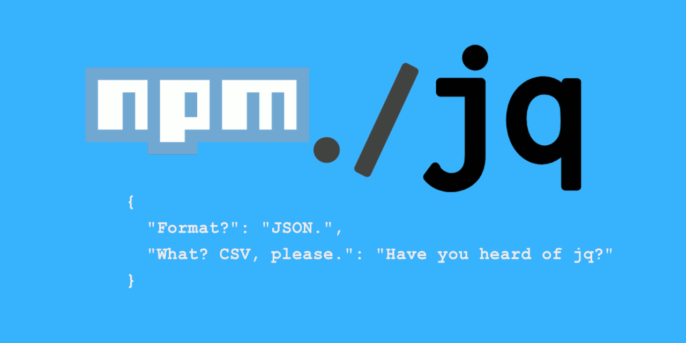

# pkg-jq

[](https://www.npmjs.com/package/pkg-jq)
[](https://www.npmjs.com/package/pkg-jq?activeTab=versions)

[](https://www.typescriptlang.org/)


> Source: [Processing JSON Data With jq](https://sites.temple.edu/tudsc/2017/09/21/processing-json-data-with-jq/)

Find the nearest package.json then deal with jq syntax on it. (in-line edit supported!)

## FEATURES

1. Search `package.json` in current and all parent directories by default, powered by [pkg-up](https://npmjs.com/package/pkg-up).
1. Use `jq` syntax to deal with the json file, powered by [node-jq](https://npmjs.com/package/node-jq).
1. `In-place` edit support by specify a `-i` or `--in-place` argument.

## USAGE

```shell
$ npm-jq --help
usage: pkg-jq [-h] [-v] [-i] [-r] filter [path]

Node.js Package jq Utility

Positional arguments:
  filter          jq filter.
  path            npm project subdir, or json file. default: $PWD.

Optional arguments:
  -h, --help      Show this help message and exit.
  -v, --version   Show programs version number and exit.
  -i, --in-place  edit files in place.
  -r, --raw       output raw strings, not JSON texts.


Exmaple: pkg-jq -i '.publishConfig.tag="next"'
```

### 1. Query

```shell
$ grep version package.json
  "version": "0.0.6",

$ pkg-jq .version
"0.0.6"

# Raw mode: -r
$ pkg-jq -r .version
0.0.6
```

### 2. Edit In Place

```shell
$ grep -E 'publish|tag' package.json
  "publishConfig": {
    "tag": "next"

$ pkg-jq -i '.publishConfig.tag="latest"'

$ grep -E 'publish|tag' package.json
  "publishConfig": {
    "tag": "latest"
```

## DEVELOPMENT

### Ubuntu

```sh
sudo apt-get install libtool
```

## HISTORY

### master

### v0.2 (10 Jun 2019)

1. Support in-line edit by `-i` parameter
1. Support raw mode by `-r` parameter
1. Good unit tests coverage
1. Travis CI DevOps

### v0.0.1 (09 Jun 2019)

1. Project inited.

## AUTHOR

[Huan LI (李卓桓)](http://linkedin.com/in/zixia) <zixia@zixia.net>

[](https://stackexchange.com/users/265499)

## COPYRIGHT & LICENSE

- Code & Docs © 2019 - now Huan LI <zixia@zixia.net>
- Code released under the Apache-2.0 License
- Docs released under Creative Commons
